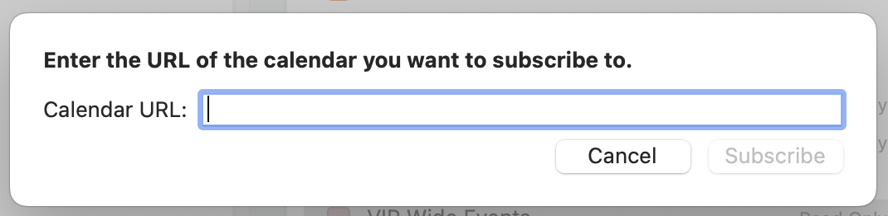
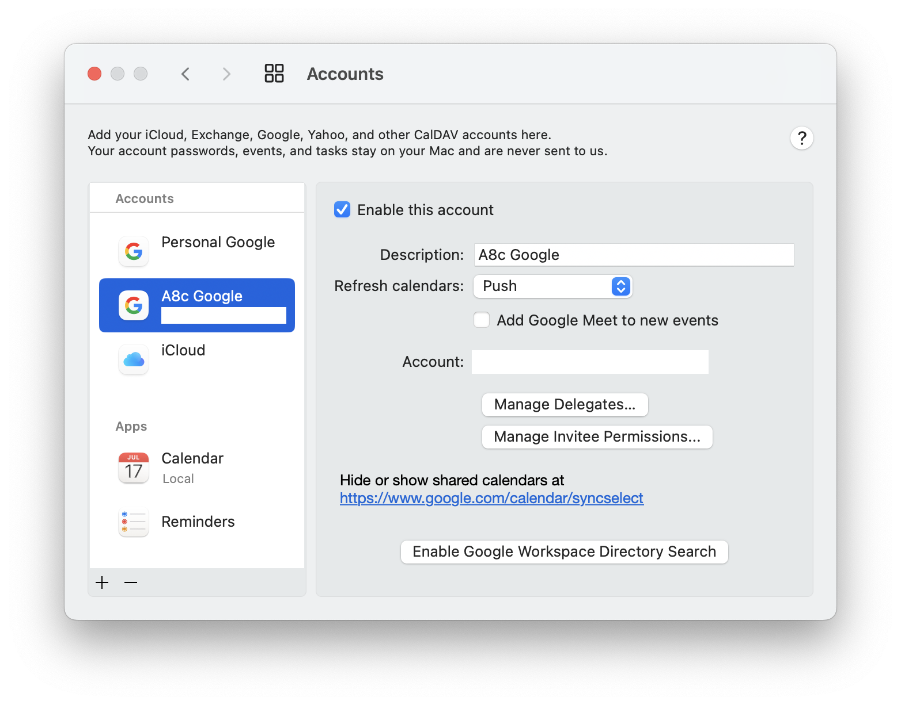

We use Google Suite at [Automattic](https://automattic.com) and there are multiple shared calendars that I need to subscribe to and pay attention to for team meetings, town halls, etc. I’ve been struggling to get those to sync into my calendar app of choice, which is [Fantastical](https://flexibits.com/fantastical). I don’t like using the web viewer because it would require me to share my personal calendar into my work calendar in order to see everything in one place. Plus, Fantastical is… fantastic.

I had tried doing a “New Calendar Subscription” and entering the calendar ID or the calendar URL from Google, but that didn’t work.

I eventually went to Settings > Account and noticed the link to Google’s Sync Settings page: [https://www.google.com/calendar/syncselect](https://www.google.com/calendar/syncselect)

Clicking that link opens a Google page that lets me choose what calendars will get synced by clients. I was able to select the shared calendars I wanted from my account, and everything started working as expected.

